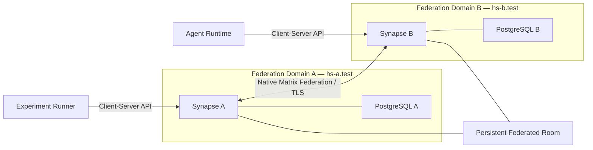
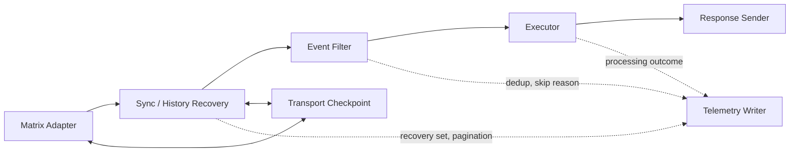

# Testbed Architecture v1.1 FINAL

**Project:** Federated Agent Messaging
**Repository:** `federated-agent-messaging`
**Date:** 2026-09-02
**Status:** FROZEN IMPLEMENTATION ARCHITECTURE
**Amends:** v1.0 — see [`CHANGELOG.md`](CHANGELOG.md)
**Depends on:** [`research-scope.md`](research-scope.md) (FROZEN, v1.1)
**Blocks:** [`experimental-protocol.md`](experimental-protocol.md)
**Purpose:** Define the minimum reproducible technical system required to evaluate C1–C5 and execute experiments E0–E4 without introducing additional research scope.

---

## 1. Purpose

The testbed exists to provide the smallest reproducible implementation capable of testing the frozen architectural claims.

It is not intended to:

- reproduce Chums;
- approximate a production messaging product;
- implement a general-purpose AI-agent framework;
- establish production scalability;
- introduce an alternative agent protocol.

The governing principle is:

> **The testbed is designed to falsify the frozen architectural claims with the smallest possible system, not to approximate a production AI messaging platform.**

Research questions, architectural requirements, and novelty boundaries are defined in [`research-scope.md`](research-scope.md).

Implementation decisions **SHALL NOT** redefine or expand them.

---

## 2. Architecture Principles

### 2.1 Minimality

Only components required to implement C1–C5 or execute E0–E4 belong on the pre-submission critical path.

### 2.2 Substrate/runtime separation

Persistent messaging state and autonomous execution state **SHALL** remain separate.

Stopping or replacing the agent runtime **SHALL NOT** remove:

- the participant's Matrix identity;
- room membership;
- persistent room events.

### 2.3 Non-privileged agent operation

After initial account provisioning, the agent **SHALL** operate entirely through ordinary Matrix Client-Server APIs.

It **SHALL NOT** receive:

- Synapse administrator credentials;
- database access;
- server filesystem access;
- server-side plugin privileges.

### 2.4 Native federation

Communication between federation domains **SHALL** use native Matrix Server-Server federation.

The prohibition applies at the Matrix / application layer. Application bridges, custom event relays, synchronization services and experiment-side forwarding mechanisms are **NOT** permitted.

Transparent TLS termination or transport-layer proxying is permitted as deployment scaffolding, provided it does not interpret, synthesize, transform or replace native Matrix Client-Server or Server-Server communication semantics.

### 2.5 Deterministic experimental core

E0–E3 **SHALL** use deterministic execution.

This isolates the messaging and federation path from:

- LLM latency;
- stochastic model output;
- provider/network variability.

### 2.6 Reproducibility

A clean checkout **SHALL** recreate the controlled test environment using documented automated commands.

### 2.7 Clean-room implementation

The repository **SHALL** contain no proprietary Chums implementation code or code derived from proprietary source.

---

## 3. High-Level System Model

The mandatory testbed contains two Matrix federation domains.



The architecture consists of three conceptual layers.

### Messaging substrate

Two unmodified Synapse homeservers provide:

- communication identities;
- persistent rooms;
- room state;
- durable events;
- history access;
- native federation.

### Participant/runtime layer

Human-role participants and autonomous participants access Matrix through ordinary client interfaces.

The agent runtime executes outside Synapse.

### Experiment layer

The experiment runner creates controlled workloads and records observations.

The experiment layer **SHALL NOT** implement any communication functionality required for the system to work.

If the experiment runner is removed, ordinary Matrix clients on Domain A and Domain B must still be able to communicate through native federation.

---

## 4. Technology Baseline

The frozen initial environment is:

| Component | Version / choice |
|---|---|
| Homeserver | Synapse 1.159.0 |
| Matrix client SDK | matrix-nio 0.26.0 |
| Python | 3.12 |
| Database | PostgreSQL 16 |
| Deployment | Docker Compose V2 |
| Matrix room version | 12 |
| Room encryption | Disabled |
| Message event type | `m.room.message` |
| Primary raw-data format | JSON Lines |
| Analysis environment | Python |

All software versions used for publication experiments **SHALL** be pinned.

Floating image tags such as:

```text
latest
stable
main
develop
```

**SHALL NOT** be used for publication data collection.

Container digests **SHOULD** also be recorded.

A dependency upgrade after data collection begins **SHALL** require either:

1. re-running all affected publication experiments; or
2. retaining the original environment for the reported results.

---

## 5. Federation Domains

The controlled environment defines two Matrix server names:

```text
hs-a.test
hs-b.test
```

Each domain has its own:

- Synapse instance;
- PostgreSQL database;
- Synapse signing key;
- TLS server certificate;
- configuration;
- persistent storage;
- Matrix user namespace.

The domains **SHALL NOT** share:

- databases;
- signing keys;
- access tokens;
- Synapse data directories;
- application state.

They share only the controlled Docker networking environment required to communicate.

The laboratory deployment models a federation boundary.

It does not claim that the homeservers are owned by separate real-world organizations.

---

## 6. Direct Federation Transport

No dedicated federation gateway is part of the mandatory architecture, and the default deployment exposes Synapse federation directly.

A transparent TLS-termination proxy **MAY** be introduced as deployment scaffolding if direct Synapse TLS proves impractical, provided it performs no Matrix-level processing.

Prohibited in all cases:

- an application bridge;
- protocol transformation;
- event rewriting, filtering or re-signing;
- any component participating in Matrix semantics.

Such a proxy is deployment scaffolding, not part of the proposed architecture, and **SHALL** be recorded in the environment manifest when present.

Each Synapse instance **SHALL** expose:

```text
Client-Server API
+
direct federation TLS listener
```

The intended logical path is:

```text
Synapse A
    ⇅
Matrix Server-Server Federation
    ⇅
Synapse B
```

The target federation listener port is:

```text
8448
```

unless implementation constraints require an equivalent documented configuration.

Docker-internal DNS **SHALL** resolve:

```text
hs-a.test
hs-b.test
```

to the respective homeserver containers.

---

## 7. Federation TLS

Federation traffic **SHALL** use TLS.

A private research certificate authority **SHALL** be generated automatically during bootstrap.

Certificates **SHALL** contain the relevant federation-domain names.

Both Synapse instances **SHALL** be configured to trust the private CA for federation traffic. Where a private federation CA is used, trust in it is a functional precondition rather than an option; Synapse provides `federation_custom_ca_list` for exactly this case.

For E4, the Client-Server endpoint used by the standard Matrix client **SHALL** be reachable over HTTPS, and the private CA **SHALL** be trusted in the browser or desktop client the human participant uses.

The human's client runs on an ordinary remote workstation rather than on the testbed host, so E4 additionally requires that:

- the Domain-A Client-Server endpoint is reachable from that workstation, not only from inside the Docker network;
- `hs-a.test` resolves to the testbed host from that workstation;
- the private CA is installed in that workstation's trust store.

A standard client will otherwise refuse the connection and E4 cannot execute. This exposure exists for E4 only and **SHALL** be recorded in the environment manifest.

The private CA exists solely to permit reproducible native federation and standard-client access inside the controlled environment.

It is not part of the proposed agent architecture.

No production or public CA infrastructure is required.

---

## 8. Matrix Room Version

All rooms used for experiments contributing to publication results **SHALL** explicitly use:

```text
Room Version 12
```

The room version **SHALL** be supplied explicitly during room creation rather than relying on a homeserver default.

The room version **SHALL** also be recorded in experiment metadata.

This prevents future Synapse default changes from silently changing federation semantics between runs.

---

## 9. Persistence Model

The architecture distinguishes three forms of state.

### 9.1 Messaging-substrate state

Synapse/PostgreSQL owns:

- Matrix participant identity;
- room identity;
- room membership;
- persistent Matrix events;
- relevant room state;
- federation state;
- accessible room history.

This is the persistence layer relevant to the central research hypothesis.

### 9.2 Agent transport state

The agent runtime **MAY** persist only the client state required to resume communication correctly.

Examples include:

- Matrix access credentials;
- client/device information;
- `/sync` position;
- experiment configuration.

This state **SHALL** remain separate from conversational content.

### 9.3 Agent reasoning state

E0–E3 **SHALL NOT** require:

- a conversational database;
- vector storage;
- RAG memory;
- private transcript storage;
- persistent LLM state.

The deterministic runtime processes events retrieved from Matrix.

The `/sync` cursor is therefore treated as a transport checkpoint, not conversational memory.

---

## 10. Persistent Interaction Space

A Matrix room instantiates the architectural concept of a persistent interaction space.

For E1, the minimum multi-party topology is:

```text
@human-a:hs-a.test
@human-b:hs-b.test
@agent:hs-b.test
```

All three participants **SHALL** join the same room.

The room **SHALL** be created by an ordinary user on Domain A.

The Domain B participants **SHALL** join through ordinary Matrix mechanisms and native federation.

Human B is deliberately placed on Domain B. It supplies an independent ordinary-client view of that domain, so cross-domain state is verified through a standard participant interface rather than through the agent's own self-report.

One consequence **SHALL** be recorded explicitly in the protocol and in the manuscript. Because Human B and the agent share Domain B, requests sent by Human B traverse a same-domain path; only Human A's requests exercise a cross-domain request/response loop. Both directions of federated event propagation are still exercised, and the two request classes **SHALL** be accounted for separately.

The room **SHALL** use:

- room version 12;
- ordinary persistent messages;
- no encryption;
- no custom Matrix event types.

The room is the persistent interaction primitive.

The agent runtime is not.

---

## 11. Participant Model

### 11.1 Programmatic human-role participants

E0–E3 use programmatic Matrix clients for repeatability.

A `HumanParticipant` represents a human-controlled communication identity in the architecture while its experimental behavior is automated.

This makes workload generation reproducible.

### 11.2 Real human participant

Every E4 session **SHALL** involve an actual human using an ordinary Matrix client. The protocol requires three independent sessions (protocol §41).

For example:

```text
@actual-human:hs-a.test      real person, Element or another standard client
         |
         v
   three-party federated persistent room
         ^                        ^
         |                        |
@human-role-b:hs-b.test    @llm-agent:hs-b.test
```

The three-party shape is required, not incidental: it is what completes C4 with an actual person present (scope §6 C4, *Empirical support*).

This scenario is functional evidence only.

It **SHALL NOT** contribute performance measurements.

---

## 12. Autonomous Agent Runtime

The agent is an external Python process.

Its minimum logical architecture is:



No part of this runtime executes inside Synapse.

The telemetry writer records what no external observer can see. It uses no privileged interface — it is the runtime's own record of its own behaviour — and therefore does not affect C2.

---

## 13. Agent Runtime Responsibilities

The runtime **SHALL** provide conceptual operations equivalent to:

```text
connect()
synchronize()
recover_missing_events()
select_relevant_event()
execute(event)
send_response()
checkpoint()
record_observation()
```

Names may differ in code.

The architectural distinction between:

```text
communication
```

and:

```text
decision/execution
```

**SHALL** remain explicit.

---

## 14. Executors

The runtime **SHALL** support two executor implementations behind the same interface.

### 14.1 DeterministicExecutor

Used for E0–E3.

Example input:

```text
FAM/1 REQUEST e3 run-017 00421
```

Example response:

```text
FAM/1 ACK e3 run-017 00421
```

For a given valid input, response behavior **SHALL** be deterministic.

It **SHALL NOT** call:

- an LLM;
- an external API;
- a random workload generator;
- an external tool.

Its processing cost **SHOULD** be small and stable relative to communication latency.

### 14.2 LLMExecutor

Used only for E4.

The LLM executor replaces only the decision function.

The following components remain unchanged:

- Matrix adapter;
- identity;
- room membership;
- synchronization;
- federation;
- response sending.

The first implementation **SHOULD** use a minimal provider adapter configured through environment variables.

No agent framework is required.

---

## 15. Experiment Runner

A separate Python process controls automated experimental execution.

Its responsibilities include:

- ordinary participant authentication;
- room creation;
- invitations;
- participant joining;
- workload generation;
- request/response correlation;
- timing;
- assertions;
- raw result recording.

During experiments the runner **SHALL** use only ordinary Matrix Client-Server APIs.

The runner **MUST NOT** possess:

- Synapse administrator credentials;
- database credentials;
- Synapse signing keys;
- server filesystem access.

---

## 16. Bootstrap Boundary

Privileged environment setup is separated from scientific experiment execution.

A dedicated bootstrap process **MAY**:

- generate Synapse configurations;
- generate signing keys;
- generate research TLS certificates;
- initialize PostgreSQL;
- create test accounts;
- provision initial passwords/tokens;
- verify homeserver health;
- verify federation transport and bootstrap readiness, and nothing beyond it.

### Bounds on federation verification

Verifying federation connectivity means only establishing that the federation transport works:

- both homeservers reachable;
- required DNS and name resolution;
- the TCP/TLS federation path;
- normal server identity and signing-key discovery.

Bootstrap and environment verification **MUST NOT** perform:

- federated room creation or join as a federation test;
- cross-domain room membership propagation checks;
- persistent room-event propagation checks;
- federated history-visibility checks.

Those behaviours are what E1 evaluates for C5. Prevalidating them during bootstrap would let a genuine C5 failure surface as an environment problem instead of an experimental finding, so they **SHALL** remain experimentally observable.

This section is normatively identical to protocol §4.1.

After provisioning completes, bootstrap credentials **SHALL NOT** be made available to:

- the agent;
- the experiment runner;
- the standard human client.

This separation is part of the evidence supporting C2.

---

## 17. Controlled Message Format

E0–E3 use ordinary:

```text
m.room.message
```

events.

No custom event type is required.

The message body contains a simple correlation envelope.

Request:

```text
FAM/1 REQUEST <experiment_id> <run_id> <sequence_id>
```

Response:

```text
FAM/1 ACK <experiment_id> <run_id> <sequence_id>
```

Example:

```text
FAM/1 REQUEST E3 FED-017 00421
```

and:

```text
FAM/1 ACK E3 FED-017 00421
```

### Fixed payload size

For E3, request and response message bodies **SHALL** each be exactly:

```text
256 bytes, UTF-8 encoded
```

The body is an ASCII-only deterministic correlation prefix followed by a fixed padding character:

```text
FAM/1 REQUEST E3 FED-017 00421 xxxxxxxx...x
FAM/1 ACK E3 FED-017 00421 xxxxxxxx...x
```

ASCII-only matters: encoded byte length then equals character length, the padding count is computable without encoding ambiguity, and both topologies carry byte-identical payloads.

The implementation **SHALL** assert the exact encoded body length before sending. A body that is not exactly 256 bytes is a defect, not a tolerance.

The requirement applies to the `m.room.message` body only. It does not apply to the complete Matrix event or federation PDU, whose JSON, signatures and transaction framing add further overhead.

RQ3 therefore characterizes one small-message workload class. Payload-size sensitivity is **NOT** studied and **SHALL** be stated as a limitation.

Structured experiment metadata **SHALL** remain primarily in the measurement output rather than requiring a custom Matrix semantic schema.

---

## 18. Matrix Transaction IDs

Every programmatically sent experimental message **SHALL** use a deterministic unique Matrix Client-Server transaction identifier.

Conceptually:

```text
fam-<experiment>-<run>-<direction>-<sequence>
```

Example:

```text
fam-e3-run017-request-00421
```

The corresponding response uses a separate transaction identifier:

```text
fam-e3-run017-response-00421
```

Transaction identifiers **SHALL** be unique within the client session.

They provide protocol-level idempotency for client retransmission.

Scientific duplicate detection **SHALL** still use Matrix `event_id` plus experiment correlation identifiers.

A retry using the same logical send operation **SHALL** reuse its original transaction identifier.

---

## 19. Synchronization Model

The agent **SHALL** normally consume persistent events through standard Matrix synchronization APIs.

A saved synchronization position **MAY** be used after runtime restart.

However, the architecture **SHALL NOT** assume that incremental `/sync` always returns every missed timeline event directly.

If synchronization reports a limited timeline or otherwise exposes a history gap, the runtime **SHALL** retrieve the missing history through standard Matrix history pagination.

Conceptually:

```text
incremental sync
      ↓
timeline complete?
      ├── yes → process
      │
      └── no
           ↓
      retrieve missing history
           ↓
      merge events
           ↓
      de-duplicate by event_id
           ↓
      process each logical request exactly once
```

No server-side or database-level history access is permitted.

Recovery correctness is defined by event-set equality and exactly-once logical processing. Matrix room history is an event graph, not a globally ordered queue, and this study asserts no ordering property.

---

## 20. Gap Recovery

The agent's recovery component **SHALL** support:

1. detection of a limited synchronization timeline;
2. retrieval of missing room events using standard Client-Server history APIs;
3. pagination until the known boundary is reached;
4. deduplication using Matrix `event_id`;
5. prevention of repeated application-level processing of the same experimental request.

The implementation **MAY** use:

```text
matrix-nio
```

where its public API exposes the required functionality.

Direct use of documented Matrix Client-Server HTTP endpoints is also permitted where necessary.

No proprietary Matrix or Synapse internals are required.

---

## 21. Runtime Interruption Model

E2 evaluates autonomous runtime interruption, not infrastructure failure.

The sequence is:

```text
Agent runtime active
        ↓
Agent checkpoint established
        ↓
Agent runtime stopped
        ↓
Both homeservers remain active
        ↓
Human participant sends persistent events
        ↓
Agent runtime restarted
        ↓
Incremental sync occurs
        ↓
Any history gap is recovered
        ↓
Events de-duplicated
        ↓
Agent processes missed requests
        ↓
Interaction resumes
```

During E2:

- Synapse A remains running;
- Synapse B remains running;
- PostgreSQL A remains running;
- PostgreSQL B remains running;
- federation remains available;
- the Matrix agent identity remains unchanged;
- room membership remains unchanged.

A complete loss of agent-local transport state is not required.

Cold restart — recovery with no retained synchronization checkpoint — is **NOT** evaluated. The core E2 case is restart with a retained transport checkpoint. This **SHALL** be stated as an explicit limitation rather than left implicit.

---

## 22. Observability Architecture

Instrumentation **SHALL** exist before E3 implementation begins.

Every logical interaction **SHALL** have:

- experiment ID;
- topology ID;
- run ID;
- sequence ID;
- sender identity;
- receiver role;
- room ID;
- request transaction ID;
- request event ID;
- response transaction ID;
- response event ID;
- local timing observations;
- outcome status.

Raw observations **SHALL** be append-only JSON Lines.

Example:

```json
{
  "schema_version": "1",
  "experiment": "E3",
  "topology": "federated",
  "run_id": "run-017",
  "block_id": "block-01",
  "sequence_id": 421,
  "room_id": "!...",
  "request_txn_id": "fam-e3-run017-request-00421",
  "request_event_id": "$...",
  "response_txn_id": "fam-e3-run017-response-00421",
  "response_event_id": "$...",
  "initiated_monotonic_ns": 123456789,
  "completed_monotonic_ns": 123999999,
  "window_start_ns": 123000000,
  "window_end_ns": 183000000,
  "phase": "window",
  "status": "ok"
}
```

`initiated_monotonic_ns` is T0 and `completed_monotonic_ns` is T3 as defined in §23. The schema carries no second clock.

The record carries execution facts only. Whether an interaction counts toward a reported metric is derived during analysis under the frozen analysis specification, never stored here (protocol §22).

### Two observation streams

Instrumentation produces two append-only streams per run, joined by `run_id`:

| Stream | Written by | Contains |
|---|---|---|
| Interaction stream | Experiment runner | One record per logical interaction, as above |
| Agent telemetry stream | Agent runtime | What no external observer can see: recovered event set, whether history pagination was invoked, deduplication decisions, per-request processing outcomes, skip reasons |

The agent telemetry stream is required because E2's acceptance criteria are agent-side facts.

Ordinary-client observation of a remote domain is **NOT** taken from agent telemetry. It comes from Human B, an ordinary participant on Domain B.

### Result location

For the entire formal campaign, **every** run-generated artifact **SHALL** be written outside the tracked working tree, at a path supplied by:

```text
FAM_RESULTS_DIR
```

That covers raw interaction streams, agent telemetry, per-run manifests, E4 evidence artifacts and environment outputs. Nothing is written into the working tree while formal data collection is in progress.

During the campaign the repository tracks schemas and analysis code only. Archival copies of manifests, processed datasets and figures are imported in a separate post-experiment commit once all formal runs are complete (§34).

Each run manifest **SHALL** record the SHA-256 of **both** of its raw streams — the runner interaction stream and the agent telemetry stream — so the externally archived dataset is verifiable file by file rather than only as a single blob.

The schema **SHALL** be versioned before publication data collection begins.

---

## 23. Timing Model

Primary latency is measured by one process using one monotonic clock.

```text
T0 = experiment runner begins request operation

...

T3 = experiment runner receives the correlated response
```

Primary interaction latency is:

```text
RTT = T3 - T0
```

This metric requires no synchronization between container clocks.

T3 **SHALL** be stamped at the very start of the runner callback for the matching ACK: after the `/sync` response has been parsed, before any application-level processing of the event.

Because `/sync` returns batches, several ACKs may share a nearly identical T3. That is a property of the transport, it applies identically to both topologies, and the definition above makes it deterministic rather than implementation-dependent.

The agent **MAY** additionally record:

```text
T1 = request becomes available to agent runtime
T2 = response send operation begins
```

allowing:

```text
agent_processing = T2 - T1
```

Cross-process latency components **SHALL NOT** be treated as primary measurements unless clock comparability is separately established.

Matrix `origin_server_ts` **SHALL NOT** be used as the primary latency clock.

---

## 24. Experimental Topologies

The testbed supports three distinct room types.

### 24.1 E0 — Same-Domain Functional Room

```text
@human-a:hs-a.test
@agent-local:hs-a.test
```

Both participants use Synapse A.

Purpose:

- C1;
- C2;
- functional baseline;
- instrumentation verification.

### 24.2 E1/E2 — Federated Multi-Party Room

```text
@human-a:hs-a.test
@human-b:hs-b.test
@agent:hs-b.test
```

Purpose:

- C3;
- C4;
- C5;
- multi-party interaction;
- federation;
- recovery.

### 24.3 E3 — Benchmark Rooms

E3 **SHALL** use two separate, structurally equivalent two-participant rooms.

**Local benchmark room**

```text
@benchmark-human:hs-a.test
@benchmark-agent-local:hs-a.test
```

**Federated benchmark room**

```text
@benchmark-human:hs-a.test
@benchmark-agent-fed:hs-b.test
```

Both rooms **SHALL** have:

- room version 12;
- encryption disabled;
- the same participant count;
- equivalent room configuration;
- equivalent initial experimental history;
- identical deterministic workload semantics.

E3 **SHALL NOT** reuse the three-participant E1 room for the local/federated comparison.

---

## 25. Benchmark Symmetry

All infrastructure services **SHALL** remain running during both E3 topologies.

In particular:

```text
Synapse A
PostgreSQL A
Synapse B
PostgreSQL B
```

remain active during local and federated measurements.

The same:

- Python runtime;
- agent source code;
- deterministic executor;
- experiment runner;
- message format;
- room version;
- measurement code;

**SHALL** be used.

Only:

- agent Matrix identity;
- agent homeserver endpoint;
- benchmark room;

change between topologies.

---

## 26. Benchmark Configuration Controls

Configuration capable of artificially limiting experimental throughput **SHALL** be identical between both domains.

Relevant configuration **SHALL** be documented.

If Matrix/Synapse client rate limits would become binding under the selected workload, they **SHOULD** either:

- be configured above the experiment's operating envelope; or
- remain enabled identically and be explicitly treated as part of the tested configuration.

The experiment **SHALL NOT** silently interpret configured rate limiting as fundamental federation capacity.

No unrelated user workload **SHALL** run on either homeserver during publication benchmarks.

---

## 27. Benchmark Execution Order

Architecture **SHALL** permit local and federated benchmark runs to be executed in alternating order.

For example:

```text
local
federated
federated
local
local
federated
...
```

The exact randomization or counterbalancing procedure belongs in [`experimental-protocol.md`](experimental-protocol.md).

The architecture **MUST NOT** require running every local experiment first and every federated experiment second.

This prevents systematic warm-up or host-state effects from being structurally tied to one topology.

---

## 28. Real Human + LLM Validation

E4 is a human-driven functional smoke test.

Minimum topology:

```text
Human using standard Matrix client
        ↓
hs-a.test
        ↓
persistent federated room
        ↓
hs-b.test
        ↓
LLM-backed agent
```

The human **SHALL** manually:

1. open the room in a standard Matrix client;
2. send a natural-language request;
3. observe an LLM-backed response from the remote agent.

The agent **SHALL** use the same Matrix communication runtime used by E0–E3.

Only the executor changes.

E4 **SHALL NOT** contribute to:

- latency statistics;
- throughput measurements;
- model-quality evaluation.

A successful documented interaction is sufficient.

---

## 29. Docker Deployment Model

The minimal long-running Docker Compose services are:

```text
synapse-a
postgres-a

synapse-b
postgres-b

agent
experiment-runner
```

Additional one-shot bootstrap tooling **MAY** exist.

No permanent reverse-proxy containers are required.

No mandatory:

- Redis;
- Kafka;
- RabbitMQ;
- Prometheus;
- Grafana;
- Jaeger;
- Kubernetes;
- service mesh;

shall be introduced.

If lightweight host/container resource measurements are needed, they **SHOULD** use existing Docker or operating-system interfaces.

---

## 30. Network Model

All publication experiments in the core study execute inside a controlled local deployment.

The network path is therefore intended to isolate:

```text
additional federation + homeserver processing
```

rather than represent geographic Internet federation.

The publication **SHALL NOT** interpret E3 results as:

- WAN latency;
- cross-region performance;
- public-Internet federation performance.

WAN or geographically distributed deployment is outside the mandatory scope.

---

## 31. Repository Layout

The implementation **SHOULD** converge toward:

```text
federated-agent-messaging/
├── README.md
├── LICENSE
├── .gitignore
├── docker-compose.yml
├── Makefile
│
├── docs/
│   ├── research-scope.md
│   ├── testbed-architecture.md
│   ├── experimental-protocol.md
│   ├── evidence-matrix.md
│   └── CHANGELOG.md
│
├── infrastructure/
│   ├── synapse-a/
│   ├── synapse-b/
│   ├── postgres/
│   └── tls/
│
├── src/
│   └── fam/
│       ├── agent/
│       │   ├── runtime.py
│       │   ├── matrix_adapter.py
│       │   └── recovery.py
│       │
│       ├── executors/
│       │   ├── deterministic.py
│       │   └── llm.py
│       │
│       ├── participants/
│       ├── instrumentation/
│       └── common/
│
├── scripts/
│   ├── bootstrap.py
│   ├── verify_environment.py
│   ├── collect_environment.py
│   └── verify_digests.py
│
├── experiments/
│   ├── e0_baseline.py
│   ├── e1_federation.py
│   ├── e2_recovery.py
│   ├── e3_overhead.py
│   └── e4_llm_human_smoke.py
│
└── results/
    ├── README.md      tracked - external raw-data artifact record
    ├── schemas/       tracked - versioned result and manifest schemas
    ├── manifests/     imported post-campaign - archival copies, one per formal run
    ├── processed/     imported post-campaign - validated datasets derived from raw
    └── figures/       imported post-campaign
```

Raw run-by-run data is **NOT** in this tree. It is written under `$FAM_RESULTS_DIR` outside the working tree (§22) and archived separately.

Empty directories **SHALL NOT** be committed merely to match this diagram.

---

## 32. Reproducibility Interface

The repository **SHOULD** expose a small stable command surface.

Conceptually:

```bash
make setup
make verify

make e0
make e1
make e2
make e3

make e4

make analyse
```

`make analyse` runs after the campaign. It reads `$FAM_RESULTS_DIR`, verifies manifest digests through `scripts/verify_digests.py`, and produces the processed datasets and figures that are then imported (§34). It is not part of any formal run.

`make setup` **MAY** perform privileged local environment initialization.

`make e0` through `make e3` **MUST NOT** depend on Synapse administrator credentials.

E0–E3 **SHALL NOT** require:

- an external LLM API;
- proprietary software;
- production infrastructure.

E4 **MAY** require an LLM API credential.

---

## 33. Environment Metadata

Every run contributing data to the manuscript **SHALL** record:

```text
Git commit
result schema version
experiment version
Synapse version
Synapse image digest
Matrix room version
matrix-nio version
Python version
PostgreSQL version
Docker version
Docker Compose version

formal-run host identifier
host OS
host kernel
host CPU
logical CPU count
available RAM
virtualization / container runtime

topology
room configuration
Synapse configuration hash
experiment configuration hash

run start time
run completion time
```

Secrets **SHALL NOT** appear in result metadata.

A sanitized environment manifest **SHALL** be generated automatically by the bootstrap / environment-verifier tooling rather than by the experiment runner. The runner has no access to server configuration, and that restriction is itself part of the C2 evidence.

During the formal campaign the environment manifest is written under `$FAM_RESULTS_DIR` with every other run-generated artifact (§22).

Configuration hashes **SHALL** be the SHA-256 of the canonicalized, secret-stripped configuration document.

The testbed and the automated formal-experiment infrastructure — Synapse, PostgreSQL, the agent runtime, the experiment runner and all E0–E3 execution — **SHALL** run on the same dedicated Linux host, identified in `protocol-lock.json`. Development and pilot work **MAY** happen on a Windows/WSL2 workstation.

Two reasons, not one. A virtualized desktop container runtime introduces scheduling noise of the same order as the effect E3 measures; and splitting the formal set across hosts would leave C1–C5 and RQ3 evidenced on different environments, with two environment manifests to reconcile.

The requirement does not extend to the physical human client in E4. The testbed and the LLM-backed agent stay on the designated deployment; the actual human **MAY** use a standard Matrix client from an external workstation, whose host or device and client version are recorded in the E4 manifest. E4 contributes no measurements, so that client's network path does not affect any reported result.

---

## 34. Result Data Integrity

Raw experiment outputs **SHALL** be treated as immutable.

The preferred lifecycle is:

```text
experiment
    ↓
raw JSONL
    ↓
validation
    ↓
processed dataset
    ↓
summary statistics
    ↓
paper table / figure
```

Analysis scripts **SHALL NOT** overwrite raw data.

Every processed result **SHOULD** retain references to:

- source experiment;
- source run;
- source raw file;
- `analysis_spec_version` — the frozen analysis specification;
- `analysis_code_commit` — its implementation.

Raw data lives outside the tracked working tree (§22). The final raw dataset **SHALL** be archived separately and identified by SHA-256, with per-file digests recorded in the run manifests.

### Post-campaign import

`HEAD` **SHALL** remain on the protocol-lock commit for the entire formal campaign.

Only after all formal runs are complete are archival copies of manifests, processed datasets and figures imported into the tracked `results/` directories, in a separate post-experiment commit.

Every imported artifact **SHALL** retain:

- `protocol_git_commit` — the lock commit under which the data was produced;
- the SHA-256 provenance of the raw streams it derives from;
- `analysis_spec_version` — the frozen analysis specification it was produced under;
- `analysis_code_commit` — the commit of the analysis-code implementation that produced it.

The commit that performs the import is none of these four. Keeping them distinct is what lets a later reader tell whether a figure changed because the data changed, because the analysis specification was revised, or only because its implementation was corrected.

`protocol_version` and `analysis_spec_version` are independent counters; protocol §3 Phase 4 defines what each governs.

---

## 35. Clean-Room Boundary

This repository is an independent implementation.

No component **SHALL**:

- copy Chums source code;
- import private Chums packages;
- use proprietary Chums services;
- reproduce proprietary implementation code;
- include private configuration;
- include internal logs;
- use production credentials.

Public:

- Matrix specifications;
- Synapse documentation;
- matrix-nio documentation;
- open-source dependencies;

are implementation sources of truth.

Coding agents working on this repository **SHOULD NOT** have filesystem access to proprietary Chums repositories where that can reasonably be avoided.

---

## 36. Security Boundary

Security evaluation is explicitly outside the first paper.

The testbed therefore uses:

- isolated research credentials;
- local/private federation;
- plaintext rooms;
- no production data;
- no public account registration;
- no public Internet federation requirement.

E2EE is intentionally disabled.

This does not constitute a recommendation for unencrypted production communication.

It is an experimental-scope decision.

---

## 37. Explicit Architecture Non-Goals

The mandatory testbed **SHALL NOT** include:

- TRC-8004;
- x402;
- blockchain infrastructure;
- decentralized identity;
- reputation systems;
- agent discovery;
- custom Matrix semantic events;
- RAG;
- vector databases;
- persistent LLM memory;
- multi-agent orchestration;
- agent planning;
- agent routing;
- E2EE evaluation;
- federation partition simulation;
- homeserver failover;
- database failover;
- WAN latency emulation;
- multi-region cloud deployment;
- Kubernetes;
- production observability infrastructure;
- cold-restart recovery with no retained transport checkpoint;
- payload-size sensitivity.

---

## 38. Traceability

| Architecture element | Research target |
|---|---|
| Stable Matrix account across runtime restart | C1 |
| External non-privileged client runtime | C2 |
| `/sync` + history gap recovery | C3 |
| Persistent three-participant room | C4 — structural portion, via E1 |
| Two native federating Synapse domains | C5 |
| Direct homeserver federation | C5 |
| Structurally equivalent benchmark rooms | RQ3 |
| Deterministic executor | RQ3 control |
| Single monotonic runner clock | RQ3 validity |
| `txnId` + `event_id` tracking | Delivery correctness |
| Standard human Matrix client with an actual person | C4 — completion, via E4 |
| LLM executor substitution | E4 / D3 |
| No custom events | Prevents D2 scope creep |
| Privileged bootstrap separated from runner | C2 evidence |
| Ordinary Domain-B participant (Human B) | C5 evidence without agent self-report |
| Agent telemetry stream | C3 evidence: recovery set, pagination, dedup |
| Fixed 256-byte payload | RQ3 workload-class control |

---

## 39. Architecture Acceptance Criteria

The testbed architecture is complete when all conditions A1–A13 pass.

### A1 — Reproducible environment

A clean checkout can initialize both homeservers, databases, TLS material, and test identities using documented commands.

### A2 — Independent federation identities

`hs-a.test` and `hs-b.test` operate using distinct:

- signing identities;
- databases;
- TLS identities;
- user namespaces.

### A3 — Native federation

The two Synapse instances exchange room events through standard Matrix Server-Server federation without an application bridge.

### A4 — No privileged runtime access

After provisioning, neither:

- agent;
- runner;

has Synapse administrator credentials.

### A5 — Ordinary agent participation

The agent can authenticate, join, receive, send, disconnect, and reconnect using standard Client-Server APIs.

### A6 — Persistent multi-party room

A room version 12 space contains:

```text
@human-a:hs-a.test
@human-b:hs-b.test
@agent:hs-b.test
```

across two federation domains, with an ordinary participant present on each side.

This establishes C4's structural portion. A13 completes C4 with an actual person.

### A7 — Bidirectional federation

Requests originating on Domain A reach the Domain B agent.

Correlated responses return to participants on Domain A.

### A8 — Runtime independence

Stopping the agent runtime does not remove:

- its Matrix identity;
- its room membership;
- the room's persistent history.

### A9 — Robust recovery

After runtime restart, the agent retrieves relevant missed events.

If synchronization exposes a limited timeline, it closes the history gap using standard Matrix history APIs.

Duplicate events are removed using `event_id`.

Correctness is event-set equality plus exactly-once processing. No ordering property is asserted.

### A10 — Deterministic idempotent communication

Programmatic sends use unique Matrix transaction identifiers and scientific correlation identifiers.

Retries do not create unintended duplicate logical requests.

### A11 — Symmetric benchmark capability

The same runtime code and deterministic workload execute in:

```text
same-domain benchmark room
```

and:

```text
federated benchmark room
```

without source-code changes.

### A12 — Measurement readiness

The runner produces machine-readable records sufficient to calculate:

- end-to-end interaction latency;
- throughput;
- delivery/failure rate.

The agent independently produces its telemetry stream, joinable by `run_id`, sufficient to evaluate E2's recovery and exactly-once criteria.

### A13 — Human + LLM validation

An actual human using a standard Matrix client can communicate, through a three-party federated room, with the LLM-backed remote agent.

The room contains the actual human on Domain A, a programmatic human-role participant on Domain B and the LLM agent on Domain B, so that C4's "at least one human participant" is satisfied literally. The protocol requires this across three independent sessions in three distinct rooms, 3/3 passing (protocol §41).

---

## 40. Implementation Completion Rule

When A1–A13 pass, the architecture is complete for the first publication.

Further engineering **MUST** be justified by:

1. a requirement in [`experimental-protocol.md`](experimental-protocol.md); or
2. a defect preventing E0–E4 execution.

Interesting implementation observations **SHALL** be classified first as:

```text
implementation defect
configuration issue
experimental observation
limitation
future work
follow-up research candidate
```

They **SHALL NOT** automatically expand the architecture.

---

## 41. Architecture Freeze

The following decisions are frozen for the core implementation:

```text
2 Synapse homeservers
2 PostgreSQL databases
native Matrix federation
direct homeserver TLS federation (transparent TLS proxy permitted as scaffolding)
private federation CA trusted by both homeservers
Matrix room version 12
Python 3.12
matrix-nio
ordinary Client-Server agent access
deterministic E0–E3 executor
LLM-backed E4 executor
plaintext rooms
single dedicated Linux host for all formal E0–E3 runs
fixed 256-byte E3 message body
runner interaction stream + agent telemetry stream
all run-generated artifacts written outside the tracked working tree
JSONL result records
Docker Compose deployment
```

The architecture may be reopened only if:

1. a frozen component is technically unable to implement C1–C5;
2. implementation reveals a methodological flaw affecting the validity of the experiments;
3. a dependency contains a material security or correctness issue requiring replacement.

Otherwise the next design artifact is:

```text
docs/experimental-protocol.md
```

which defines workloads, repetition counts, warm-up, controlled variables, failure criteria, statistical treatment, and experiment-by-experiment execution procedures.
